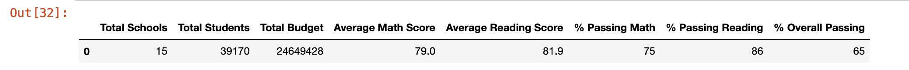

# School_District_Analysis

### Resources
* Python 3.9.0, 
* Anaconda Navigator 1.9.12,
* Jupyter notebook 6.0.3,
* Pandas, NumPy
* Data Source: clean_students_complete.csv

## Project Overview

### initial analysis

in the first part of this analysis, we are going to explore the data to analyse the different schools in the district, in order to see how they compare to each other based on different metrics; for that we are goign to produce

- A high-level snapshot of the district's key metrics, presented in a table format
- An overview of the key metrics for each school, presented in a table format
- Tables presenting each of the following metrics: 
  * Top 5 and bottom 5 performing schools, based on the overall passing rate
  * The average math score received by students in each grade level at each school
  * The average reading score received by students in each grade level at each school
  * School performance based on the budget per student
  * School performance based on the school size 
  * School performance based on the type of school
 
 ### results 
#### Output for the initial anlysis:

- Districts Details:
- 

- metrics per school: 

- detailed matrics tables :

* top 5 school based on overall passing rate.

 

* bottom 5 school based on overall passing rate.

* Average math score per grade per school.

* Average reading score per grade per school.

* Performance based on the budget per student

* Performance by the school size 

* Performance by school type

