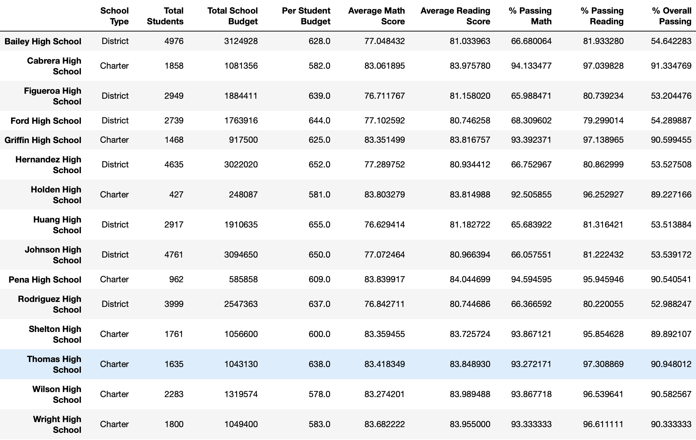
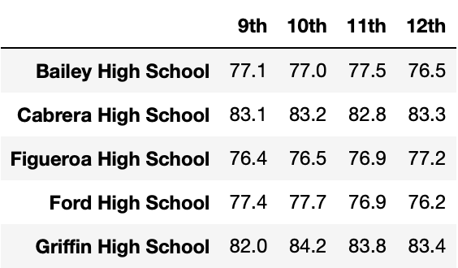
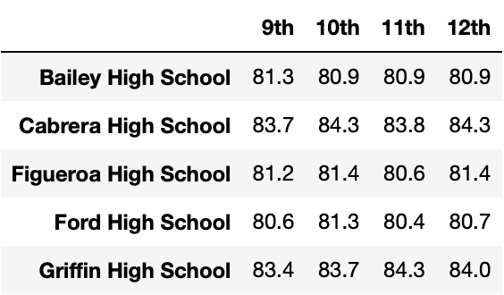
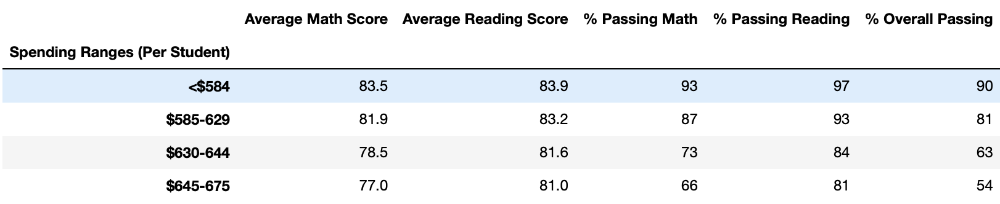

# School_District_Analysis

### Resources
* Python 3.9.0, 
* Anaconda Navigator 1.9.12,
* Jupyter notebook 6.0.3,
* Pandas, NumPy
* Data Source: clean_students_complete.csv

## Project Overview

### initial analysis

in the first part of this analysis, we are going to explore data from different schools in the district, in order to see how they compare to each other based on different metrics; for that we are goign to produce

- A high-level snapshot of the district's key metrics, presented in a table format
- An overview of the key metrics for each school, presented in a table format
- Tables presenting each of the following metrics: 
  * Top 5 and bottom 5 performing schools, based on the overall passing rate
  * The average math score received by students in each grade level at each school
  * The average reading score received by students in each grade level at each school
  * School performance based on the budget per student
  * School performance based on the school size 
  * School performance based on the type of school
 
 ### results 
#### Output for the initial anlysis:

- Districts Details:


- metrics per school: 


##### detailed matrics tables :

* top 5 school based on overall passing rate.
 

* bottom 5 school based on overall passing rate.


* Average math score per grade per school.


* Average reading score per grade per school.


* Performance based on the budget per student


* Performance by the school size 


* Performance by school type


### additional Analysis

After rumors of academic dishonesty at Thomas High School relating to the 9th grad math and reading scores, we were adviced to not take the data that relates to the incident into account, and to reproduce the same analysis with the new altered data, in order to see if that would affect the previously displayed results.

for that we will :

nullify all 9th graders math and reading scores:

 ```python
student_data_df.loc[(student_data_df["grade"] == "9th") & (student_data_df["school_name"] == "Thomas High School"), ["math_score","reading_score"]] = np.nan
 ```
- we can see that here :


- Districts Details become :
- 


- metrics per school become: 
- 


we can see that Thomas High School's average scores went down by about the third.

In order to keep integrity and fairness on our part, we are going to replace the average scores for Thomas High School with the new averages that discount the 9th grad scores.


##### detailed matrics tables :

* new top 5 school based on overall passing rate.
 

we can see that Thomas High School is still amongst the top 5 schools even whithout taking the contested data into account. 

* bottom 5 school based on overall passing rate.


we can see no effect on the bottom shools.

* Average math score per grade per school.


we see a Nan for 9th grad for Thomas High School

* new Average reading score per grade per school.


* new Performance based on the budget per student


* new Performance by the school size 


* new Performance by school type


 
